# Guide: Implementing Real-Time AI Response & Thinking Streaming with Socket.io

This document is a comprehensive guide to shifting an AI-powered chat application from standard synchronous request-response execution to **real-time token and thinking/tool-calling streaming** using a hybrid pattern of **HTTP POST and Socket.io**.

By reading this guide, you will understand the architecture, before-and-after code modifications, and patterns so you can implement streaming (including tool-calling steps) in any future application.

---

## 1. Architectural Concepts: How Streaming Works

In standard chat applications, the server receives a prompt, sends it to the AI model, waits for the complete response (which can take 5 to 30 seconds), and returns the full message. This blocks the UI and creates a poor user experience.

Streaming solves this by transmitting tokens (words/characters) and tool-calling thoughts to the client immediately as they are generated.

```mermaid
sequenceDiagram
    autonumber
    actor Client as Frontend Client
    participant Server as Express Server
    participant Socket as Socket.io Server
    participant AI as LangChain / LLM

    Client->>Server: HTTP POST /messages (socketId, messages, chatId)
    Note over Server: Authenticates, validates, & generates<br/>temporary mongoose message ID.
    Server-->>Client: HTTP 201 Response (chat & temporary AI message details)
    Client->>Client: Renders User message & empty AI bubble instantly
    
    Server->>AI: generateStreamResponse(history)
    
    rect rgb(30, 30, 40)
        Note over Server, AI: Tool Invocation Flow (e.g. Internet Search)
        AI-->>Server: event "on_tool_start"
        Server->>Socket: Emit "chat_thinking" (e.g. "[Searching: internet_search...]")
        Socket-->>Client: Receive "chat_thinking"
        Client->>Client: Renders search status in thinking block
        AI-->>Server: event "on_tool_end"
        Server->>Socket: Emit "chat_thinking" (e.g. "[Found information...]")
        Socket-->>Client: Receive "chat_thinking"
    end

    rect rgb(40, 30, 30)
        Note over Server, AI: Model Streaming Flow
        loop As chunks are generated
            AI-->>Server: Yields token chunk ("on_chat_model_stream")
            Server->>Socket: Emit "chat_chunk" to socketId
            Socket-->>Client: Receive "chat_chunk" (token)
            Client->>Client: Appends token to AI bubble in real-time
        end
    end
    
    Server->>Server: Saves final completed response & thoughts to DB
    Server->>Socket: Emit "chat_done" (full response + accumulated thoughts)
    Socket-->>Client: Receive "chat_done" (Finalise state)
```



### Why we chose the Hybrid HTTP + Socket.io Pattern
When designing streaming APIs, there are two primary methods:
1. **Server-Sent Events (SSE)** (HTTP-based).
2. **WebSockets (Socket.io)** (TCP-based).

In this application, we chose a **Hybrid HTTP POST + Socket.io** pattern:
- **Authentication & Validation:** Kept on HTTP POST. Express middlewares (`identifyUser` cookie parser, validators) work out of the box without needing to write complex custom cookie parsing or authentication handshake wrappers inside Socket.io.
- **Database Consistency:** Chat documents are created immediately on HTTP POST. The client receives the MongoDB `_id` instantly, keeping the frontend state perfectly synced with the database.
- **Low Latency Chunks:** The actual stream tokens and intermediate tool execution states are transmitted over WebSockets (Socket.io), avoiding HTTP chunking timeouts or reverse-proxy buffering (e.g., Nginx buffering).

---

## 2. File-by-File Changes & Explanations

Here is a breakdown of the changes made to implement streaming for both text output and search thinking states.

### Component A: AI Service Layer (Backend)
#### File: `Backend/src/services/ai.service.js`

* **Prompt & Model Upgrades:**
  We transitioned from local Ollama (Qwen) to **Google Gemini 2.5 Flash** (`ChatGoogleGenerativeAI`) to ensure high-performance tool orchestration (using `tavilySearchTool`). We also injected a dynamic system message containing the current time and date so search queries remain contextually relevant.

* **Before (Synchronous):**
  We used `.invoke()`, which blocks thread execution and waits for the model to finish.
  ```javascript
  const res = await agent.invoke({ messages: formatted });
  return res.messages[res.messages.length - 1].content;
  ```

* **After (Streaming):**
  We added a new function using Langchain's `.streamEvents()` engine:
  ```javascript
  export const generateStreamResponse = async (messages) => {
    const systemPrompt = new SystemMessage(
      `You are a helpful assistant. You have access to the internet using the tavilySearchTool (named internet_search). Use it when you need to search the internet for up-to-date and real-time information.
  Current Date: ${new Date().toLocaleDateString('en-US', { weekday: 'long', year: 'numeric', month: 'long', day: 'numeric' })}
  Current Time: ${new Date().toLocaleTimeString('en-US', { hour: '2-digit', minute: '2-digit', second: '2-digit' })}`
    );

    const formatted = [
      systemPrompt,
      ...messages.map((msg) => {
        if (msg.role === "user") return new HumanMessage(msg.content);
        if (msg.role === "ai") return new AIMessage(msg.content);
      }).filter(Boolean)
    ];
    
    return agent.streamEvents(
      { messages: formatted },
      { version: "v2" }
    );
  };
  ```
  > **Note**: `.streamEvents(..., { version: "v2" })` yields fine-grained events during execution. We listen to `on_tool_start` and `on_tool_end` to stream search/thinking steps, and `on_chat_model_stream` to stream final response tokens.

---

### Component B: API Controller (Backend)
#### File: `Backend/src/controller/chatController.js`

* **Refactoring for Background Asynchronous Generation:**
  Instead of saving the message beforehand and blocking the response thread, we:
  1. Generate a temporary message `ObjectId` using `new mongoose.Types.ObjectId()`.
  2. Send an instant HTTP 201 response containing `{ chat, Aimessage: tempAimessage }` (with empty content) so the frontend immediately renders the message bubble.
  3. Start the event stream loop in the background.
  4. Track tool-calling events:
     - On `on_tool_start`: Emit `"chat_thinking"` with a status (e.g. `[Searching: internet_search...]`).
     - On `on_tool_end`: Emit `"chat_thinking"` with completion status.
  5. Track model tokens:
     - On `on_chat_model_stream`: Emit `"chat_chunk"` with the text token.
  6. On completion: Save the fully formulated response and the accumulated search thoughts to the database in a single write operation, then emit `"chat_done"`.

  ```javascript
  if (socketId) {
    const tempMessageId = new mongoose.Types.ObjectId();
    const tempAimessage = {
      _id: tempMessageId,
      chat: targetChatId,
      content: "",
      role: "ai",
    };

    // Respond immediately with the chat and temporary AI message details
    res.status(201).json({ chat, Aimessage: tempAimessage });

    (async () => {
      try {
        const io = getId();
        const eventStream = await generateStreamResponse(allMsg);
        let fullResponse = "";
        let currentThinking = "";

        for await (const event of eventStream) {
          if (event.event === "on_tool_start") {
            currentThinking += `[Searching: ${event.name}...]\n`;
            io.to(socketId).emit("chat_thinking", {
              chatId: targetChatId,
              messageId: tempMessageId,
              thinking: currentThinking,
            });
          } else if (event.event === "on_tool_end") {
            currentThinking += `[Found information from ${event.name}]\n\n`;
            io.to(socketId).emit("chat_thinking", {
              chatId: targetChatId,
              messageId: tempMessageId,
              thinking: currentThinking,
            });
          } else if (event.event === "on_chat_model_stream") {
            const token = event.data.chunk.content;
            if (token) {
              fullResponse += token;
              io.to(socketId).emit("chat_chunk", {
                chatId: targetChatId,
                messageId: tempMessageId,
                token,
              });
            }
          }
        }

        // Save complete document to DB at the end
        const savedAimessage = await messageModel.create({
          _id: tempMessageId,
          chat: targetChatId,
          content: fullResponse,
          thinking: currentThinking,
          role: "ai",
        });

        io.to(socketId).emit("chat_done", {
          chatId: targetChatId,
          messageId: savedAimessage._id,
          content: fullResponse,
          thinking: currentThinking,
        });

      } catch (streamError) {
        io.to(socketId).emit("chat_error", { chatId: targetChatId, messageId: tempMessageId, error: "Failed to generate complete response" });
      }
    })();
    return;
  }
  ```

---

### Component C: Socket Client (Frontend)
#### File: `Frontend/src/features/chat/service/chat.socket.js`

* **Connection Persistence:**
  We updated the connection initializer to cache the `socket` reference, allowing React hooks to grab the `socket.id` and send it over the HTTP post body.
  ```javascript
  export let socket = null;

  export const inializeSocketConnection = () => {
      if (!socket) {
          socket = io("http://localhost:3000", {
              withCredentials: true,
              autoConnect: true,
          });
      }
      return socket;
  };
  ```

---

### Component D: Redux State & Hook Integration (Frontend)
#### File: `Frontend/src/features/chat/chat.slice.js`

We extended our state management with three reducers to append thoughts and tokens on incoming websocket frames:
1. `createNewMessage`: Stores user message and initializes AI messages with empty strings and an empty `thinking` field.
2. `appendTokenToLastMessage`: Appends response tokens to the last AI message.
3. `updateLastMessageThinking`: Appends or replaces search and thinking steps in the message bubble.
4. `updateLastMessageContent`: Hard-sets the final `message` and `thinking` properties when `"chat_done"` arrives.

```javascript
updateLastMessageThinking: (state, action) => {
    const { chatId, thinking } = action.payload;
    if (state.chats[chatId] && state.chats[chatId].message.length > 0) {
        const messageList = state.chats[chatId].message;
        const lastMsg = messageList[messageList.length - 1];
        if (lastMsg.role === "ai") {
            lastMsg.thinking = thinking;
        }
    }
},
```

#### File: `Frontend/src/features/chat/Hooks/useChat.js`

We hooked up the socket listeners to dispatch changes in real-time:
```javascript
  function setupSocketListeners(socketInstance) {
    if (!socketInstance) return;

    socketInstance.off("chat_chunk");
    socketInstance.off("chat_thinking");
    socketInstance.off("chat_done");
    socketInstance.off("chat_error");

    socketInstance.on("chat_thinking", ({ chatId, thinking }) => {
      dispatch(updateLastMessageThinking({ chatId, thinking }));
    });

    socketInstance.on("chat_chunk", ({ chatId, token }) => {
      dispatch(appendTokenToLastMessage({ chatId, token }));
    });

    socketInstance.on("chat_done", ({ chatId, content, thinking }) => {
      dispatch(updateLastMessageContent({ chatId, message: content, thinking }));
      dispatch(setisLoading(false));
    });

    socketInstance.on("chat_error", ({ chatId, error }) => {
      dispatch(appendTokenToLastMessage({ chatId, token: "\n\n⚠️ Error generating response." }));
      dispatch(setisLoading(false));
    });
  }
```

---

## 3. How to Implement this in any Future Project

To implement this pattern in any future Node/Express + React application, follow this checklist:

### 1. Enable Event Streaming in the AI Handler
Ensure you return an event emitter or stream object that yields tool starts/ends and model tokens separately.
- In LangChain: Use `agent.streamEvents(..., { version: "v2" })`.
- In raw OpenAI: Stream tool-calls by parsing `delta.tool_calls` chunks and final reply tokens by parsing `delta.content`.

### 2. Expose WebSocket Client ID
- Always store the Socket client connection globally or in a state-provider so the HTTP API can access `socket.id`.

### 3. Respond with Metadata Instantly
- Save a reference ID in the DB.
- Respond with HTTP status 201 immediately so the frontend has a target to append tokens to.
- Run the stream as an unblocked background task.

### 4. Wire up State listeners
- In React, register listeners for token chunks and thinking states on socket connection.
- Target the last element of the active chat array in your store (Redux, Zustand) to update content in real-time.
